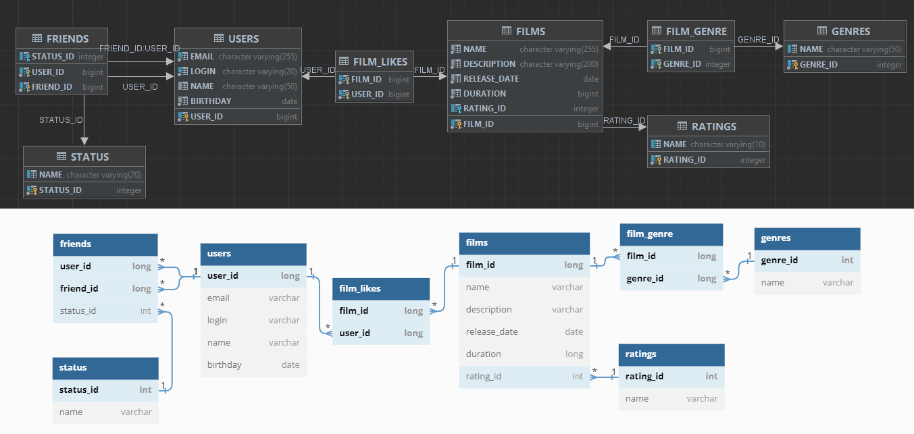

Написано на момент месяца SQL
# Запросы к базе данных на примере пользователей (users) и их дружбы (friends)
добавление пользователя
```sql
INSERT INTO users(email, login, name, birthday) 
VALUES (?, ?, ?);
```

обновление пользователя
```sql
UPDATE users 
SET email = ?, login = ?, name = ?, birthday = ? 
WHERE user_id = ?
```

получение пользователей
```sql
SELECT * 
FROM users
```

получение пользователя по id
```sql
SELECT * 
FROM users 
WHERE user_id = ?
```

удаление пользователя по id
```sql
DELETE FROM users 
WHERE user_id = ?
```

добавление друга
```sql
INSERT INTO friends (user_id, friend_id, status_id) 
VALUES (?, ?, ?)
```

удаление друга
```sql
DELETE FROM friends 
WHERE user_id = ? 
      AND friend_id = ?
```

получение друзей
```sql
SELECT f.friend_id, s.name 
FROM friends f 
LEFT JOIN status s ON f.status_id = s.status_id
WHERE f.user_id = ?
```

обновление статуса дружбы
```sql
UPDATE friends SET status_id = ? 
WHERE user_id = ? 
      AND friend_id = ?
```
