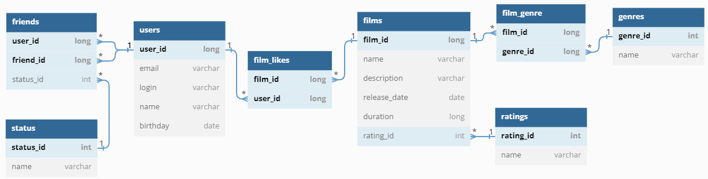

[](https://nypost.com/2022/05/31/movie-theaters-have-popcorn-candy-shortages-over-inflation/)
# filmorate - сервис оценки фильмов и получения рекомендаций
[](https://www.oracle.com/java/)
[](https://spring.io/projects/spring-framework) 
[](https://www.postgresql.org/)
[](https://www.postgresql.org/)
[](https://maven.apache.org/)
[](https://junit.org/junit5/docs/current/user-guide/)
[](https://www.postman.com/)

## Описание
Приложение, похожее на кинопоиск. В нём пользователи могут ставить оценки фильмам и добавлять других пользователей в друзья
## Архитектура
Монолитное приложение, данные хранятся в БД H2. Обращение к БД через JDBC template
## Функциональность
| Эндпоинт | Описание |
| - | - |
| GET /users | получение списка пользователей |
| GET /users/{id} | получение пользователя по id |
| POST /users | добавление пользователя |
| DELETE /users/{id} | удаление пользователя по id |
| PUT /users | изменение информации о пользователе |
| PUT /users/{id}/friends/{friendId} | добавление пользователя в друзья |
| DELETE /users/{id}/friends/{friendId} | удаление пользователя из друзей |
| GET /users/{id}/friends | получение списка друзей пользователя |
| GET /users/{id}/friends/common/{otherId} | получение общих друзей двух пользователей |
| GET /films | получение списка фильмов |
| GET /films/{id} | получение фильма по id |
| POST /films | добавление фильма |
| PUT /films | изменение информации о фильме |
| GET /films/{filmId}/like/{userId} | добавление лайка фильму |
| DELETE /films/{filmId}/like/{userId} | удаление лайка у фильма |
| GET /films/popular?count={count} | получение списка популярных фильмов длиной count. Параметр count не обязательный, по умолчанию равен 10 |
| GET /genres | получение списка жанров фильмов |
| GET /genres/{id} | получение жанра по id |
| GET /mpa | получение списка рейтингов MPAA фильмов |
| GET /mpa/{id} | получение рейтинга MPAA по id |

## Диаграмма базы данных

## Тестирование
Написано 26 юнит-тестов для основной функциональности приложения с использованием аннотации @SpringBootTest
## Как запустить и использовать
Откройте командную строку cmd и выполните следующие команды

   ```
git clone https://github.com/OsipovKonstantin/java-filmorate.git
   ```
В командной строке перейдите в корень проекта. Далее
   ```
mvn clean package
   ```
   ```
java -jar target\filmorate-0.0.1-SNAPSHOT.jar
   ```
Приложение готово к использованию! Сервис доступен по андресу [http://localhost:8080](http://localhost:8080)

Со сценариями работы приложения ознакомьтесь, посмотрев и запустив [коллекцию Postman-тестов](postman/filmorate.json)

Дальнейшая разработка приложения велась в [групповом проекте](https://github.com/GlazyrinAV/java-filmorate)
